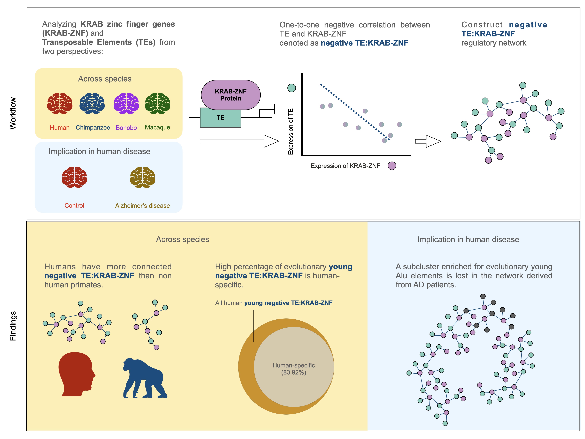

# primateBrain_TEKRABZNF

This repo contains the source code to reproduce results in [Regulatory networks of KRAB zinc finger genes and transposable elements changed during human brain evolution and disease](https://www.biorxiv.org/content/10.1101/2023.12.18.569574v2).



## preTEKRABber pipeline is provided
You can find the steps including: (1) using fastp to remove low quality reads and trimmed adapters (2) using STAR to align reads to reference genome (3) use TEtranscripts to quantify the expression of genes and transposable elemens.
[repo link](https://github.com/ferygood/preTEKRABber_pipe)

## in-house software used
To reduce the redundancy of codes, several functions is from R twice package. You can download it from github:

```R
devtools::install_github("ferygood/twice")
```

## Datasets
Two independent RNA-seq dataset were used in this study. 
- Cross-species: [GSE127898](https://www.ncbi.nlm.nih.gov/geo/query/acc.cgi?acc=GSE127898)
- Control-Alzheimer's disease: [syn5550404](https://www.synapse.org/#!Synapse:syn5550404)


Contact: yao-chung.chen@fu-berlin.de


